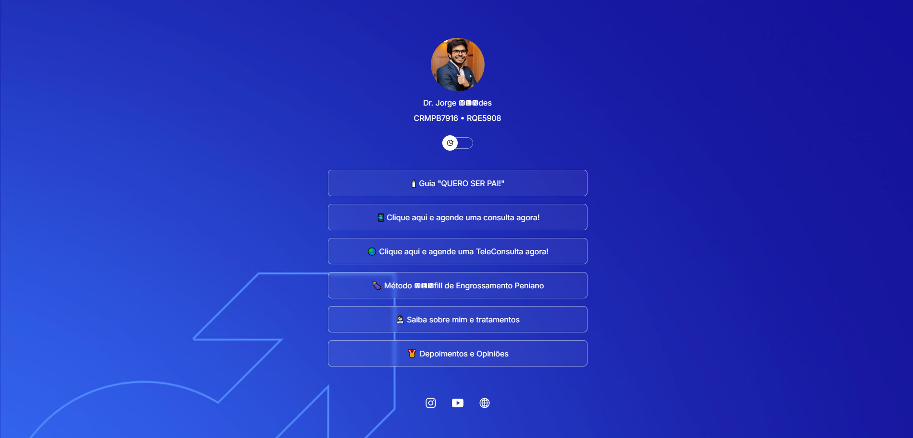

<h1 align="center">BioCliente</h1>

  <a href="#-tecnologias">Tecnologias</a>&nbsp;&nbsp;&nbsp;|&nbsp;&nbsp;&nbsp;
  <a href="#-projeto">Projeto</a>&nbsp;&nbsp;&nbsp;|&nbsp;&nbsp;&nbsp;
  <a href="#memo-licença">Licença</a>

  

 

## 🚀 Tecnologias

Esse projeto foi desenvolvido com as seguintes tecnologias:

- HTML e CSS
- JavaScript
- Git e Github
- Figma

## 💻 Projeto

O DevLinks é um agregador de links para usar como cartão de visitas online.

- [Acesse o projeto finalizado, online](https://drjorgemendes.com.br/bio/?fbclid=PAZXh0bgNhZW0CMTEAAaZvWB7J2xxylYsTDhyCsbgulxaiVwuqKRl6jgK_iFTOdIDQ6rZqNdbMzOY_aem_IjdkLMfjTz4pQLN07FLaXw)

## :memo: Licença

Esse projeto está sob a licença MIT.

---

Feito com ♥ by Thalita Noemi :wave:
